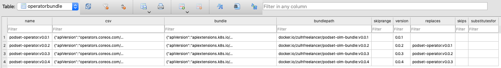

## Resources

* [Deploying Kubernetes Operators with Operator Lifecycle Manager bundles](https://developers.redhat.com/blog/2021/02/08/deploying-kubernetes-operators-with-operator-lifecycle-manager-bundles)
* [Deploying Operators with OLM bundles](https://www.redhat.com/en/blog/deploying-operators-olm-bundles)

## Install operator process

1. [OLM operator and CRDs](https://github.com/operator-framework/operator-lifecycle-manager/releases)
2. Created `podset-system` namespace
3. CatalogSource
4. OperatorGroup
5. Subscription
6. Operator (auto-installed during installation)
7. CSV (auto-installed during installation)

Check if they are running:

```
$ kubectl get catalogsource,operatorgroup,subscription,operator,csv,ip -A

# OR

$ watch kubectl get catalogsource,operatorgroup,subscription,operator,csv,ip -A
```

Check Docker image version of running operator:

```
$ kubectl -n podset-system get pod -l control-plane=controller-manager -o json | jq -r '.items[0].spec.containers[1].image'
```

**Notes**:

* The `ip` is InstallPlan and we don't have to deal with it
* Check out [olm-manifests.yaml](olm-manifests.yaml) file to see what we need to apply to the cluster

## Auto update operator process

* Make sure `replaces: podset-operator.v0.0.prev-version` is added under `.spec` of the CSV YAML file
* Use `--from-index` flag when running the `opm index add` command
* The index image passed to the `--from-index` flag will be pulled from internet
    * If we are creating a new index image for v0.0.4 bundle (which will replace v0.0.3) but we didn't push the index image with bundle v0.0.3 stuffs inside it, the `opm index add` will fail because it found a blackhole between v0.0.2 and v0.0.4

## Uninstall operator process

1. Delete Subscription
2. Delete CSV (operator pods will get terminated after this step) - don’t delete csv/packageserver in olm namespace
3. Delete CRDs
4. Delete Operator (will success if CRDs get deleted as well - see above)
5. Delete OperatorGroup
6. Delete CatalogSource

## Other tips

* If you want to see what's inside the OLM database for your operator, run the [olm-download-index-db.sh](olm-download-index-db.sh) file to download the DB
    
* The auto-update will not happen immediately - it depends on what you've configured in the CatalogSource `.spec.updateStrategy.registryPoll.interval`
* When your operator is running on quite old build i.e. v0.0.1 and the latest that's available in index image is v0.0.4
    * the upgrade path will be `v0.0.1 -> v0.0.2 -> v0.0.3 -> v0.0.4` with 3 hops
    * the waiting period at each hop may equal to CatalogSource `.spec.updateStrategy.registryPoll.interval`
    * so, in this example, the waiting period for complete update from v0.0.1 to v0.0.4 can be 30 minutes (assuming the _interval_ above) is 10 minutes
* When the latest operator version in index image is not the first i.e. v0.0.4 and you proceed with installation (by creating OperatorGroup, CatalogSource and Subscription), it will jump straight to v0.0.4/latest version
* From my testing, you can add other Kubernetes manifests/YAMLs too inside the `bundle/manifests` folder and they will get applied to your cluster (see [configmap.yaml](configmap.yaml))
* If you are curious what OPM version I was using while testing this, it's [v1.17.2](https://github.com/operator-framework/operator-registry/releases/tag/v1.17.2)
